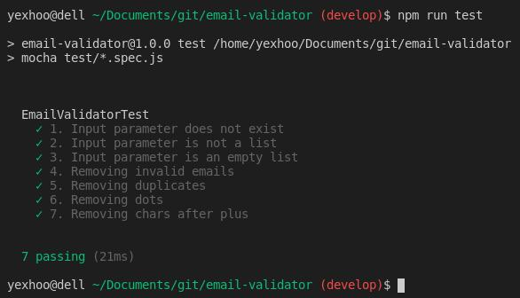

# Email Validator


Email Validator allows you to take an email list for applying a set of rules to obtain a new email list.

Background:

Every email address has two main parts: a username and domain name. The "username" comes first, followed by an at (@) symbol, followed by the "domain name". For example, if you take next email addres "mail@techterms.com" the "mail" is the "username and "techterms.com" is the "domain name".

Requirements:

- If "username" contains a period (‘.’) Between two characters of the local name, the email will be sent to the
Same address without the point. For example, pe.dro@techterms.com and pedro@techterms.com send to
the same direction. (Note that this only applies to "username" ).
- If "username" contains a plus (‘+’), everything that comes after the most is ignored.
This allows some emails to be filtered, for example pedro+perez@techterms.com will be
sent to pedro@techterms.com. (Note that this only applies to the part of the local name).
- It is possible to apply both rules at the same time.


### Tech

Email Validator uses open source projects to work properly:

* [NodeJS](https://nodejs.org/en/) - Node.js® is a JavaScript runtime built on Chrome's V8 JavaScript engine.

* [Mocha](https://mochajs.org/) - Mocha is a feature-rich JavaScript test framework running on Node.js and in the browser, making asynchronous testing simple and fun.

* [Chai](https://www.chaijs.com/) - Chai is a BDD / TDD assertion library for node and the browser that can be delightfully paired with any javascript testing framework.

### Installation

Email Validator requires [Node.js](https://nodejs.org/) v12.14.1+ to run.

Install the dependencies.

```sh
$ cd email-validator
$ npm install
```

For run tests ...

```sh
$ npm run test
```




----

MIT